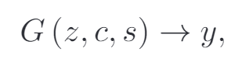
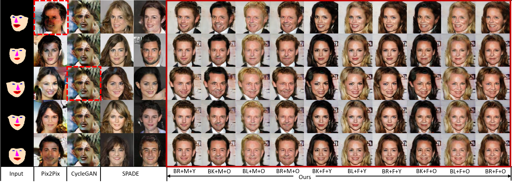
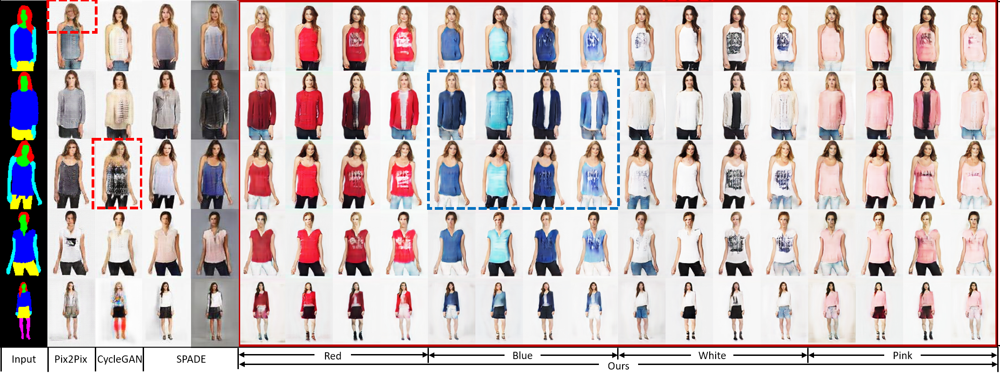

## Welcome to SCGAN Homepage

An official PyTorch implementation of paper "Spatially Constrained GAN for Face and Fashion Synthesis" in FG2021.

By [Songyao Jiang](https://www.songyaojiang.com/), [Hongfu Liu](http://hongfuliu.com/), [Yue Wu](http://wuyuebupt.github.io/) and [Yun Fu](http://www1.ece.neu.edu/~yunfu/).

[Smile Lab @ Northeastern University](https://web.northeastern.edu/smilelab/)

## Problem Definition
### Goal
Decouple the image synthesis task into three dimensions (i.e., spatial, attribute and latent dimensions), control the spatial and attribute-level contents, and randomize the other unregulated contents. Our goal can be described as finding the mapping 




where  is the generating function,  is the latent vector of size , and  is the conditionally generated image which complies with the target conditions  and . 

### Motivations
- Face and fashion synthesis are inherently one-to-many mapping from semantic segmentations to real images.
### Key Contributions
- SCGAN decouples the face and fashion synthesis task into three dimensions (spatial, attribute, and latent). 
- A particularly designed generator extracts spatial information from segmentation, utilizes variations in random latent vectors and applies specified attributes. A segmentor network guides the generator with spatial constraints and improves model convergence.
- Extensive experiments on the CelebA and DeepFashion datasets demonstrate the effectiveness of SCGAN.

## SCGAN Framework
[](img/framework.png)


## Experiment
### Qualitative Results
[](img/compare_celeba.png)

[](img/compare_deepfashion.png)

### Quantitative Evaluation


## Citation
If you find this repo useful in your research, please consider citing 
```
@inproceedings{jiang2021spatially,
  title={Spatially Constrained GAN for Face and Fashion Synthesis},
  author={Jiang, Songyao and Tao, Zhiqiang and Fu, Yun},
  booktitle={2021 16th IEEE International Conference on Automatic Face \& Gesture Recognition (FG 2021)},
  year={2019},
  organization={IEEE}
}

@inproceedings{jiang2019segmentation,
  title={Segmentation guided image-to-image translation with adversarial networks},
  author={Jiang, Songyao and Tao, Zhiqiang and Fu, Yun},
  booktitle={2019 14th IEEE International Conference on Automatic Face \& Gesture Recognition (FG 2019)},
  pages={1--7},
  year={2019},
  organization={IEEE}
}
```

<!-- ```markdown
Syntax highlighted code block

# Header 1
## Header 2
### Header 3

- Bulleted
- List

1. Numbered
2. List

**Bold** and _Italic_ and `Code` text

[Link](url) and 
``` -->