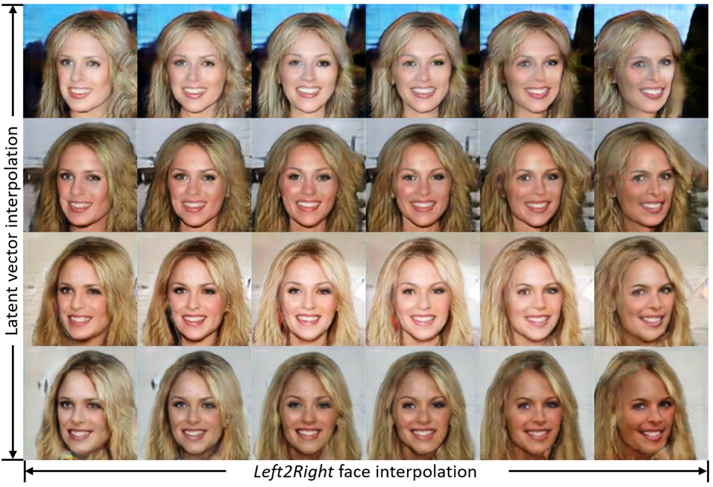

[](img/logo-color-dark.png)  

This is the official project page of our paper "Spatially Constrained GAN for Face and Fashion Synthesis" that has been accepted to FG 2021 as oral and received the **NVIDIA CCS Best Student Paper Award**!

by [Songyao Jiang](https://www.songyaojiang.com/), [Hongfu Liu](http://hongfuliu.com/), [Yue Wu](http://wuyuebupt.github.io/) and [Yun Fu](http://www1.ece.neu.edu/~yunfu/).


[Smile Lab @ Northeastern University](https://web.northeastern.edu/smilelab/)

[](img/logo-color-dark.png)  

<!-- ## Table of Contents
* [Problem Definition](#Problem-Definition)
    * [Goal](#Goal)
    * [Motivations](#Motivations)
    * [Key Contributions](#Key-Contributions)
* [Method](#Method)
    * [SCGAN Framework](#SCGAN-Framework)
    * [Objective Functions](#Objective-Functions)
    * [Training Algorithm](#Training-Algorithm)
* [Experiment](#Experiment)
    * [Qualitative Results](#Qualitative-Results)
    * [Quantitative Evaluation](#Quantitative-Evaluation)
* [Citation](#Citation) -->


## Problem Definition
### Goal
SCGAN decouples the image synthesis task into three dimensions (i.e., spatial, attribute and latent dimensions), control the spatial and attribute-level contents, and randomize the other unregulated contents. 

Our goal can be described as finding the mapping 


where  is the generating function,  is the latent vector of size (), and  is the conditionally generated image which complies with the target conditions  and . 

### Motivations
- Face and fashion synthesis are inherently one-to-many mapping from semantic segmentations to real images.   
  
### Key Contributions
- SCGAN decouples the face and fashion synthesis task into three dimensions (spatial, attribute, and latent). 
- A particularly designed generator extracts spatial information from segmentation, utilizes variations in random latent vectors and applies specified attributes. A segmentor network guides the generator with spatial constraints and improves model convergence.
- Extensive experiments on the CelebA and DeepFashion datasets demonstrate the effectiveness of SCGAN.

## Method

### SCGAN Framework
Our proposed SCGAN consists of three networks shown below, which are a generator network G, a discriminator network D, and a segmentor network S. 
[](img/framework.png)
- We utilize a generator network G to match our desired mapping function . generator takes three inputs which are a latent code z, an attribute label c, and a target segmentation map s. As shown in the above figure, these inputs are fed into the generator step by step in orders. This particular design of G decides the spatial configuration of the synthesized image according to the spatial constraints extracted from s. Then G forms the basic structure (e.g., background, ambient lighting) of the generated image using the information coded in z. After that, G generates the attribute components specified by c.
- We employ a discriminator network D which forms a GAN framework with G. An auxiliary classifier is embedded in D to do a multi-class classification which provides attribute-level and domain-specific information back to G.
- We propose a segmentor network S to provide spatial constraints in conditional image generation. S takes either real or generated image data as input and outputs the probabilities of pixel-wise semantic segmentation results

### Objective Functions
- **Adversarial Loss**. We adopt a conditional objective from
Wasserstein GAN with gradient penalty  
,    
which can be rewritten as  
  
- **Classification Loss**  for real and fake samples are defined as   
,   
,  
- **Segmentation Loss**  acts as a spatial constraint to regulate the generator to comply with the spatial information defined by the input semantic segmentation. The proposed real segmentation loss to optimize the segmentor network $S$ can be described as  
,  
,  
- **Overall Objectives** to optimize S, D and G in SCGAN can be represented as   
,  
,  
.

### Training Algorithm
Pseudo-code to train the proposed SCGAN can be found [here](img/algorithm.png).

### Network Architecture
[](img/architecture.PNG)

## Experiment
We verify the effectiveness of SCGAN on a face dataset **CelebA** and a fashion dataset **DeepFashion**. We show both visual and quantitative results compared with four representative methods. 
### Datasets
[](https://mmlab.ie.cuhk.edu.hk/projects/CelebA.html)
[](https://mmlab.ie.cuhk.edu.hk/projects/DeepFashion/FashionSynthesis.html)

CelebA is a face attribute dataset:
- 10,177 identities,
- 202,599 number of face images, and
- 5 landmark locations, 
- 40 binary attributes annotations.

DeepFashion is a large-scale clothes database with 50 categories, 1,000 descriptive attributes. We use its Fashion Synthesis subset:
- 78,979 images, 
- Captions of attributes,
- Ground-truth segmentations.


### Qualitative Results
Results on CelebA dataset:  

[](img/compare_celeba.png)  
Results on DeepFashion dataset:  
[](img/compare_deepfashion.png)  
NoSmile2Smile Interpolation:                 
[](img/nosmile2smile.png)  
Left2Right interpolation:    
[](img/left2right.png)  

### Quantitative Evaluation
Evaluation:
- Visual quality
- Spatial correctness

Metrics:
- Frechet Inception Distance (FID)
- Pixel Accuracy
- Mean IoU (intersection over union)


### Ablation Study of Generator Architecture
Our proposed architecture: 
- Step-by-step generator G.
- From coarse to fine synthesis.

Alternative architecture:
- Input all at once generator G.

Compared alternative generator, our proposed step-by-step generator has:
- Better visual quality.
- Sharper details
- No foreground-background mismatch.

[](img/ablation_generator.jpg) 


### Ablation Study of Model Convergence
Settings:
- SCGAN.
- w/o Segmentor.
- w/o Segmentor & Classifier.

Benefits of Segmentor S:
- Stabilizing training.
- Faster convergence.
- Lower loss when converged.
- Better image quality.

[](img/ablation_convergence.jpg) 

## Citation
If you find this repo useful in your research, please consider citing 
```
@inproceedings{jiang2021spatially,
  title={Spatially Constrained GAN for Face and Fashion Synthesis},
  author={Jiang, Songyao and Hongfu Liu and Yue Wu and Fu, Yun},
  booktitle={2021 16th IEEE International Conference on Automatic Face \& Gesture Recognition (FG 2021)},
  year={2021},
  organization={IEEE}
}

@inproceedings{jiang2019segmentation,
  title={Segmentation guided image-to-image translation with adversarial networks},
  author={Jiang, Songyao and Tao, Zhiqiang and Fu, Yun},
  booktitle={2019 14th IEEE International Conference on Automatic Face \& Gesture Recognition (FG 2019)},
  pages={1--7},
  year={2019},
  organization={IEEE}
}
```

## Contacts
- [Songyao Jiang](https://songyaojiang.com/): jiangsongyao@gmail.com

<!-- ```markdown
Syntax highlighted code block

# Header 1
## Header 2
### Header 3

- Bulleted
- List

1. Numbered
2. List

**Bold** and _Italic_ and `Code` text

[Link](url) and 
``` -->